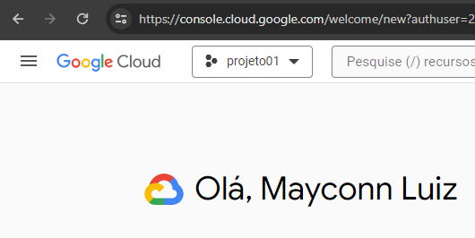
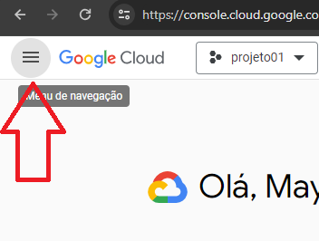
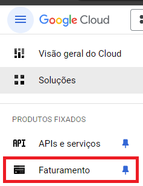
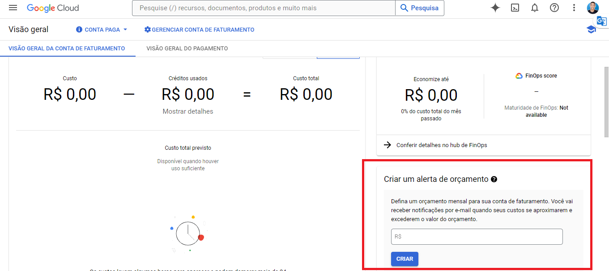
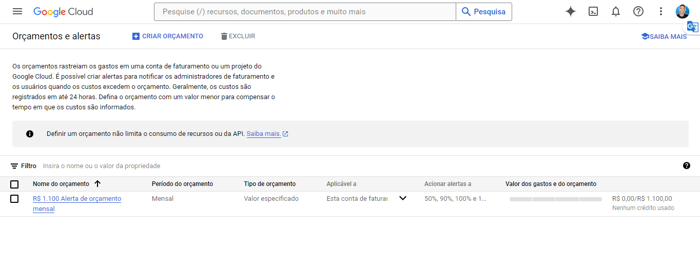

## Como definir um alerta de orçamento no GCP

### Passo 1: Acesse o console GCP
[Acesse o console GCP](https://console.cloud.google.com/)  

### Passo 2: Expanda o menu superior à esquerda
Clique para expandir o menu superior à esquerda  

### Passo 3: Clique em Faturamento
Clique em Faturamento  

### Passo 4: Defina um valor no bloco "Criar um alerta de orçamento"
No painel que abrir, defina um valor no bloco "Criar um alerta de orçamento" e clique em criar  

### Passo 5: Alerta criado!
Pronto, alerta criado!!  

