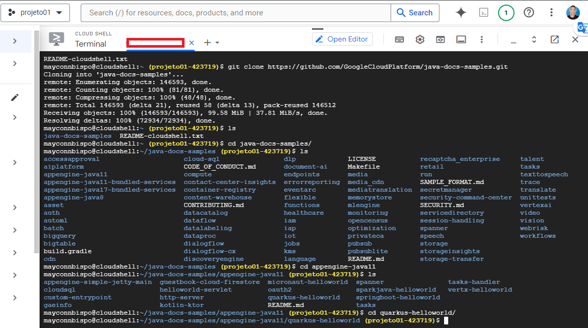
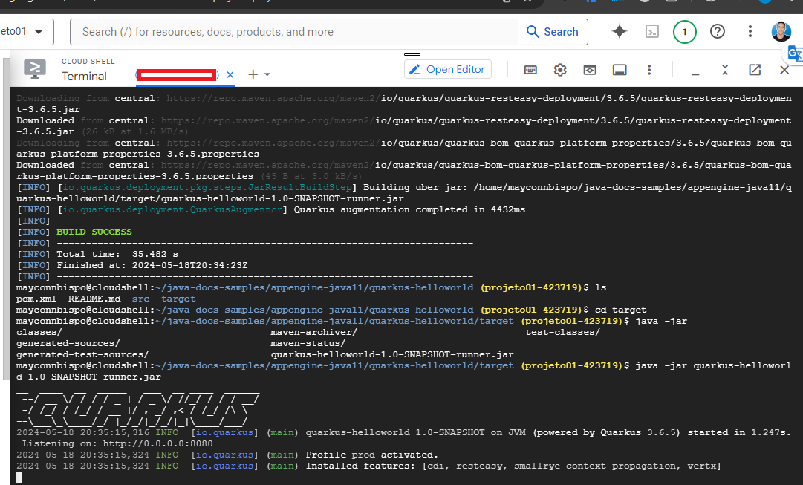

## Instruções para Build e Execução de Aplicação Quarkus no Cloud Shell

### 1. Abra o Cloud Shell no GCP Console:
   - Acesse o [Google Cloud Console](https://console.cloud.google.com/).
   - Clique no ícone do Cloud Shell localizado no canto superior direito da janela.

### 2. Clone o repositório Git:
   - Use o comando abaixo para clonar o repositório Git da sua aplicação Quarkus:
     ```bash
     git clone https://github.com/GoogleCloudPlatform/java-docs-samples.git
     ```

### 3. Navegue até o diretório do projeto Quarkus:
   - Use o comando `cd` para entrar no diretório do projeto Quarkus que você clonou:
     ```bash
     cd java-docs-samples/appengine-java11/quarkus-helloworld
     ```

### 4. Realize o build da aplicação:
   - Execute o seguinte comando Maven para realizar o build da aplicação Quarkus:
     ```bash
     mvn clean package -DskipTests
     ```

### 5. Execute a aplicação:
   - Após o build ser concluído com sucesso, execute o seguinte comando para iniciar a aplicação Quarkus:
     ```bash
     java -jar quarkus-helloworld-1.0-SNAPSHOT-runner.jar
     ```

### IMAGENS
   
   
